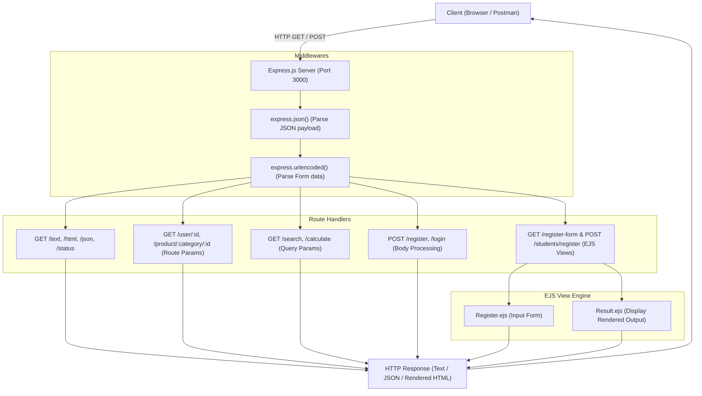

# Experiment 2: Backend Development with Node.js, Express.js & EJS Templating

---

### **Student Information**
- **Name:** Gaurav Bhaskar
- **SAP ID:** 590012457
- **Course:** Backend Development
- **Semester:** 5th Semester

---

## 1. Aim
To build, configure, and understand a backend web server using **Node.js** and **Express.js**, demonstrating request-response cycles, routing mechanisms (GET & POST), handling route parameters (`req.params`), parsing query parameters (`req.query`), body-parsing middlewares (`req.body`), HTTP status codes, and server-side dynamic templating using **EJS (Embedded JavaScript)**.

---

## 2. Objectives
- Understand the Node.js runtime environment, package management with `npm`, and development tooling (`nodemon`).
- Initialize and configure an Express application with built-in body-parsing middlewares (`express.json()` and `express.urlencoded()`).
- Implement various response types including plain text, raw HTML, and structured JSON payloads.
- Handle dynamic URL route parameters (`/user/:id`, `/product/:category/:id`) and URL query parameters (`/search`, `/calculate`).
- Build POST endpoints for data processing and mock authentication with appropriate HTTP status codes (`200 OK`, `201 Created`, `401 Unauthorized`).
- Configure and render dynamic server-side web pages using the EJS view engine (`Register.ejs` and `Result.ejs`).

---

## 3. High-Level Flowcharts & Execution Pipelines

### 3.1 One-Liner Core Request-Response Lifecycle
```
[Client Request] ➔ [Express Server :3000] ➔ [Body-Parsing Middleware] ➔ [Matched Route Handler] ➔ [Business / Calculation Logic] ➔ [Response (JSON / HTML / EJS Render)] ➔ [Client Browser / Postman]
```

### 3.2 One-Liner Feature Flowcharts
1. **Route Parameters:**
   `GET /product/:category/:id ➔ Extract req.params ➔ Construct Payload ➔ Return JSON { category, productId }`
2. **Query Parameters & Calculator:**
   `GET /calculate?num1=10&num2=5&operation=add ➔ Extract req.query ➔ Execute Switch-Case ➔ Return JSON { num1, num2, operation, result }`
3. **Mock Authentication (POST /login):**
   `POST /login { email, password } ➔ Parse req.body ➔ Validate Credentials ➔ If Match: 200 OK + JWT Token | If Invalid: 401 Unauthorized`
4. **Server-Side Rendering (EJS Form Submission):**
   `GET /register-form ➔ Render Register.ejs (HTML Form) ➔ User Submits Form ➔ POST /students/register ➔ Parse URL-encoded body ➔ Render Result.ejs with Dynamic Variables`

### 3.3 Mermaid Architecture Diagram



---

## 4. Theory & Core Concepts

### 4.1 What is Node.js and Express.js?
- **Node.js** is an open-source, cross-platform JavaScript runtime environment built on Google Chrome's V8 engine that allows developers to run JavaScript outside the browser on the server side. It operates on an asynchronous, event-driven, single-threaded architecture suitable for building I/O-intensive web applications.
- **Express.js** is a fast, minimalist, and flexible web framework for Node.js that provides a robust suite of features for building web and mobile applications, RESTful APIs, and middleware pipelines.

### 4.2 Middleware in Express
Middlewares are functions that have access to the request object (`req`), the response object (`res`), and the `next` middleware function in the application’s request-response cycle.
- `express.json()`: Built-in middleware that parses incoming requests with JSON payloads and populates `req.body`.
- `express.urlencoded({ extended: true })`: Parses incoming requests containing URL-encoded data submitted via HTML forms.

### 4.3 Routing Mechanisms
- **Direct Endpoints:** Standard path-matching routes (e.g., `/text`, `/html`, `/json`).
- **Route Parameters (`req.params`):** Named URL segments used to capture values specified at their position in the URL (e.g., `/user/:id`).
- **Query Parameters (`req.query`):** Key-value pairs appended after the `?` in the URL (e.g., `/search?q=nodejs&page=2`), widely used for filtering, searching, and pagination.

### 4.4 HTTP Status Codes
- `200 OK`: Request succeeded.
- `201 Created`: Request succeeded and a new resource was created.
- `401 Unauthorized`: Authentication failed or credentials missing/invalid.

### 4.5 Server-Side Rendering (SSR) with EJS
**EJS (Embedded JavaScript)** is a templating engine that allows generating dynamic HTML markup with plain JavaScript.
- Syntax `<%= variable %>` outputs the value into the HTML template safely.
- Server passes an object of variables to `res.render('viewName', { data })` which evaluates on the server and sends fully formed HTML to the client.

---

## 5. Implementation & Code Breakdown

### 5.1 Project Structure
```
lab/Lab2/
└── nodejs-express-lab/
    ├── package.json         # Project metadata and dependencies (express, ejs, nodemon)
    ├── script.js            # Basic Node.js script demonstrating JS execution & array methods
    ├── app.js               # Main Express application with routes and middleware
    └── view/                # EJS View templates
        ├── Register.ejs     # Registration form template
        └── Result.ejs       # Registration result dynamic template
```

---

### 5.2 Source Code Walkthrough

#### 1. `script.js` — Fundamental JavaScript on Node.js
```javascript
console.log("Hello from Node.js!");

const name = "Student";
const course = "Backend Development";

console.log(`Welcome ${name} to ${course}`);

const numbers = [1, 2, 3, 4, 5];
const sum = numbers.reduce((acc, num) => acc + num, 0);
console.log(`Sum of numbers: ${sum}`);
```
- **Explanation:** Demonstrates template literals, variable declaration, and array aggregation using the higher-order `.reduce()` method running directly in the Node.js runtime.

---

#### 2. `app.js` — Express Web Server & Routing API
```javascript
const express = require('express');
const app = express();
const PORT = 3000;

// View engine setup
app.set('view engine', 'ejs');
app.set('views', './views');

// Middleware
app.use(express.json());
app.use(express.urlencoded({ extended: true }));

// 1. Basic Responses
app.get('/', (req, res) => res.send('Welcome to Express!'));
app.get('/text', (req, res) => res.send('This is plain text response'));
app.get('/html', (req, res) => res.send('<h1>HTML Response</h1><p>This is HTML content</p>'));
app.get('/json', (req, res) => {
  res.json({
    message: 'This is JSON response',
    status: 'success',
    data: { name: 'Student', course: 'Backend Development' }
  });
});
app.get('/status', (req, res) => res.status(201).json({ message: 'Created successfully' }));

// 2. Route Parameters
app.get('/user/:id', (req, res) => {
  res.json({ message: 'User details', userId: req.params.id });
});

app.get('/product/:category/:id', (req, res) => {
  const { category, id } = req.params;
  res.json({ category, productId: id });
});

// 3. Query Parameters
app.get('/search', (req, res) => {
  const { q, page, limit } = req.query;
  res.json({ searchQuery: q, page: page || 1, limit: limit || 10 });
});

app.get('/calculate', (req, res) => {
  const { num1, num2, operation } = req.query;
  const n1 = parseFloat(num1);
  const n2 = parseFloat(num2);
  let result;
  switch (operation) {
    case 'add': result = n1 + n2; break;
    case 'subtract': result = n1 - n2; break;
    case 'multiply': result = n1 * n2; break;
    case 'divide': result = n2 !== 0 ? n1 / n2 : 'Error: Division by zero'; break;
    default: result = 'Invalid operation';
  }
  res.json({ num1: n1, num2: n2, operation, result });
});

// 4. POST Requests & Body Handling
app.post('/register', (req, res) => {
  const { username, email } = req.body;
  res.json({ message: 'Registration successful', user: { username, email } });
});

app.post('/login', (req, res) => {
  const { email, password } = req.body;
  if (email === 'test@example.com' && password === 'password123') {
    res.json({ success: true, message: 'Login successful', token: 'sample-jwt-token' });
  } else {
    res.status(401).json({ success: false, message: 'Invalid credentials' });
  }
});

// 5. Dynamic EJS Views
app.get('/register-form', (req, res) => {
  res.render('register');
});

app.post('/students/register', (req, res) => {
  const { name, email, course, semester } = req.body;
  res.render('result', { name, email, course, semester });
});

app.listen(PORT, () => console.log(`Server running on http://localhost:${PORT}`));
```

---

#### 3. EJS Templates (`Register.ejs` and `Result.ejs`)
- **`Register.ejs`**: HTML form collecting `name`, `email`, `course`, and `semester` sending an HTTP POST to `/students/register`.
- **`Result.ejs`**: Consumes backend dynamic variables (`<%= name %>`, `<%= email %>`, `<%= course %>`, `<%= semester %>`) and dynamically displays the registered details with a link to register another student.

---

## 6. Endpoints & Test Cases Summary Table

| Endpoint | Method | Input / Params | Response Type | Expected Output / Status Code |
| :--- | :---: | :--- | :--- | :--- |
| `/` | `GET` | None | Plain Text | `"Welcome to Express!"` (200 OK) |
| `/text` | `GET` | None | Plain Text | `"This is plain text response"` (200 OK) |
| `/html` | `GET` | None | HTML | `<h1>HTML Response</h1>...` (200 OK) |
| `/json` | `GET` | None | JSON | `{ message: "This is JSON response", ... }` (200 OK) |
| `/status` | `GET` | None | JSON | `{ message: "Created successfully" }` (201 Created) |
| `/user/:id` | `GET` | URL param `id=101` | JSON | `{ message: "User details", userId: "101" }` (200 OK) |
| `/product/:category/:id` | `GET` | Params `category=electronics`, `id=45` | JSON | `{ category: "electronics", productId: "45" }` (200 OK) |
| `/search` | `GET` | Query `?q=javascript&page=2&limit=5` | JSON | `{ searchQuery: "javascript", page: "2", limit: "5" }` (200 OK) |
| `/calculate` | `GET` | Query `?num1=20&num2=5&operation=divide` | JSON | `{ num1: 20, num2: 5, operation: "divide", result: 4 }` (200 OK) |
| `/register` | `POST` | JSON `{ username: "gaurav", email: "gaurav@example.com" }` | JSON | `{ message: "Registration successful", user: { ... } }` (200 OK) |
| `/login` | `POST` | Body `{ email: "test@example.com", password: "password123" }` | JSON | `{ success: true, message: "Login successful", token: "sample-jwt-token" }` (200 OK) |
| `/login` (Fail) | `POST` | Body `{ email: "wrong@email.com", password: "xyz" }` | JSON | `{ success: false, message: "Invalid credentials" }` (401 Unauthorized) |
| `/register-form` | `GET` | None | EJS Rendered HTML | Interactive Student Registration Form (200 OK) |
| `/students/register` | `POST` | Form data (`name`, `email`, `course`, `semester`) | EJS Rendered HTML | Rendered Result Page displaying submitted values (200 OK) |

---

## 7. Observations
1. **Separation of Concerns:** Express routing allows clean segregation of routes based on HTTP methods (`GET`, `POST`) and URL patterns.
2. **Middleware Execution:** Without `express.json()` and `express.urlencoded()`, `req.body` returns `undefined` for incoming request payloads.
3. **Dynamic Routing:** Route parameters (`req.params`) simplify building RESTful APIs by embedding identifiers directly in the URL hierarchy.
4. **Query Handling:** Query strings (`req.query`) enable flexible filtering, pagination, and runtime arithmetic computation without changing route paths.
5. **Template Engine Power:** EJS bridges backend data with frontend views, enabling real-time HTML document construction prior to sending the response to the client.

---

## 8. Conclusion
In this laboratory experiment, a complete backend application was successfully constructed using **Node.js** and **Express.js**. The experiment provided practical hands-on experience in building API routes, processing client input via headers, parameters, and request bodies, handling status codes, and rendering dynamic server-side pages with **EJS**. The concepts learned form the backbone of modern web API and full-stack backend development.
