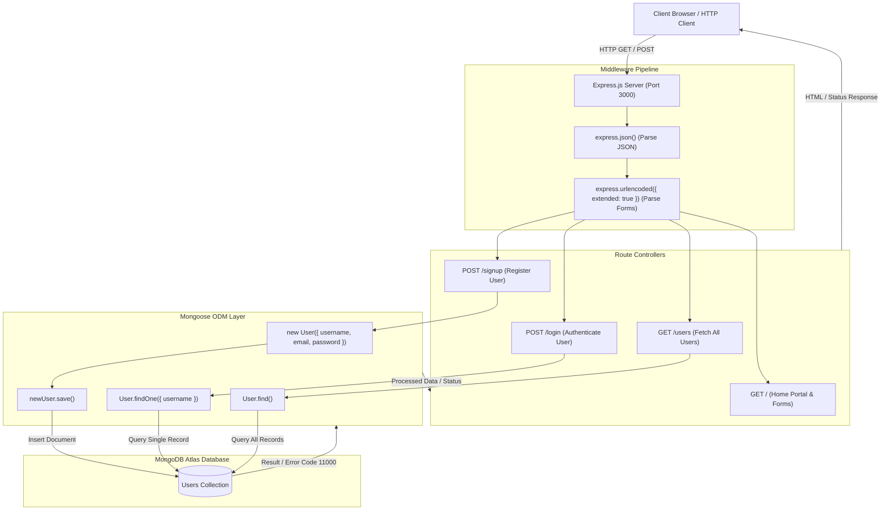
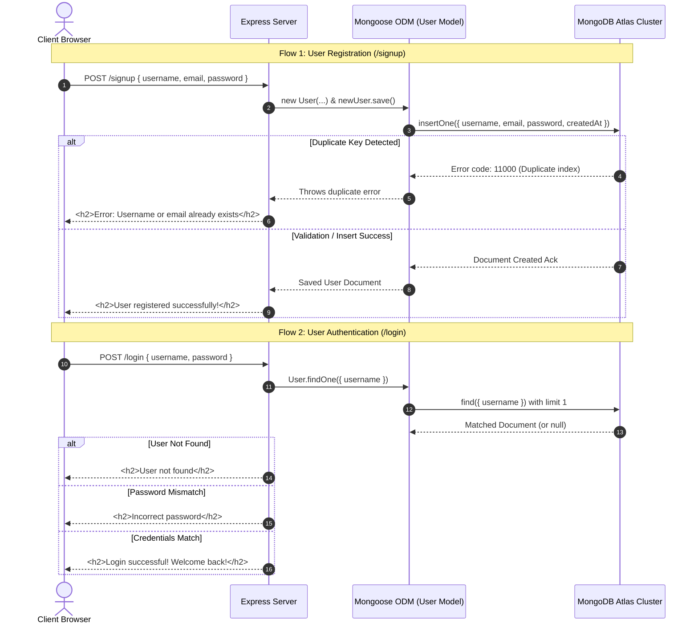

# Experiment 14: MongoDB Integration and CRUD Operations using Mongoose & Express.js

---

### **Student Information**
- **Name:** Gaurav Bhaskar
- **SAP ID:** 590012457
- **Course:** Backend Development
- **Semester:** 5th Semester

---

## 1. Aim
To design, implement, and understand database integration and persistence in a **Node.js** and **Express.js** web application using **MongoDB** and the **Mongoose ODM (Object Data Modeling)** library, building a complete User Management System featuring schema definitions, field validation, unique indexing, asynchronous CRUD operations, and error handling.

---

## 2. Objectives
- Understand the architecture of NoSQL document-oriented databases (MongoDB) and the role of an Object Data Modeling (ODM) library (Mongoose).
- Configure and establish an asynchronous connection to MongoDB (MongoDB Atlas cloud cluster / local instance) with promise handling (`.then()` and `.catch()`).
- Define a structured **Mongoose Schema** with data types (`String`, `Date`), validation constraints (`required: true`), unique indexes (`unique: true`), and default values (`default: Date.now`).
- Compile the schema into a **Mongoose Model** for database interactions.
- Implement user registration (`POST /signup`) with data validation and handle duplicate key conflicts (MongoDB error code `11000`).
- Implement user authentication and credential verification (`POST /login`) using Mongoose query methods like `findOne()`.
- Retrieve and display all stored records (`GET /users`) using `User.find()`.
- Serve an interactive web interface (`GET /`) with forms to perform end-to-end user registration, authentication, and data viewing.

---

## 3. High-Level Flowcharts & Execution Pipelines

### 3.1 One-Liner Core Execution Workflows

1. **Database Connection Lifecycle:**
   ```
   [Server Start] ➔ [mongoose.connect(DB_URL)] ➔ [Promise Resolved] ➔ [Console: "Connected to MongoDB successfully"] (or Catch: Connection Error)
   ```

2. **User Registration Workflow (`POST /signup`):**
   ```
   [Client Form Submission] ➔ [express.urlencoded Parser] ➔ [Extract req.body] ➔ [Instantiate new User({...})] ➔ [await newUser.save()] ➔ [If Duplicate (Error 11000): "Username or email already exists" | If Success: "User registered successfully!"]
   ```

3. **User Authentication Workflow (`POST /login`):**
   ```
   [Client Login Submission] ➔ [Extract username & password] ➔ [await User.findOne({ username })] ➔ [Check if User Exists] ➔ [Compare Password] ➔ [If Match: "Login successful!" | If Mismatch: "Incorrect password" | If Not Found: "User not found"]
   ```

4. **Retrieve All Users Workflow (`GET /users`):**
   ```
   [Client GET /users] ➔ [await User.find()] ➔ [Check length > 0] ➔ [Loop over documents] ➔ [Construct Dynamic HTML List (Username, Email, Date)] ➔ [Send HTML Response to Client]
   ```

---

### 3.2 Mermaid Architecture & Request Pipeline Diagram



---

### 3.3 Mermaid Sequence Diagram for Registration & Authentication



---

## 4. Theory & Core Concepts

### 4.1 What is MongoDB?
**MongoDB** is a popular open-source, distributed, document-oriented NoSQL database. Unlike traditional relational databases (RDBMS) that store data in structured rows and columns across tables, MongoDB stores data in flexible, JSON-like **BSON (Binary JSON)** documents grouped into collections.

- **Document:** A record inside a MongoDB collection (analogous to a row in SQL).
- **Collection:** A group of MongoDB documents (analogous to a table in SQL).
- **Key Advantages:** Dynamic schema, horizontal scalability (sharding), high read/write performance, and native JSON support.

### 4.2 What is Mongoose ODM?
**Mongoose** is an **Object Data Modeling (ODM)** library for MongoDB and Node.js. It acts as an abstraction layer that provides a structured, schema-based solution to model application data while managing relationships, schema validations, type casting, query building, and business logic hooks.

| Concept | Description |
| :--- | :--- |
| **Schema** | Defines the blueprint and shape of documents within a collection, specifying field names, data types, validators, and default values. |
| **Model** | A compiled wrapper constructor around the schema that provides a programming interface to query, insert, update, and delete documents in MongoDB. |
| **Document** | An individual instance of a Mongoose model representing a single record in the database. |

### 4.3 Schema Types and Validation Rules
Mongoose supports strict schema definitions and built-in validators:
- `type: String / Number / Date / Boolean / ObjectId`: Enforces data type casting.
- `required: true`: Marks the field as mandatory; attempts to save without it trigger a validation error.
- `unique: true`: Automatically creates a unique index in MongoDB to prevent duplicate entries (e.g., preventing duplicate emails or usernames).
- `default: Date.now`: Automatically populates the field with a default value at creation time if no value is provided.

### 4.4 MongoDB Duplicate Key Handling (Error Code `11000`)
When a unique index constraint is violated (e.g., creating a user with an already registered email or username), MongoDB rejects the write operation and throws an error with error code `11000`. Handling `error.code === 11000` allows backend servers to gracefully return user-friendly error messages rather than crashing or throwing unhandled promise rejections.

---

## 5. Implementation & Code Breakdown

### 5.1 Project Directory Structure
```
lab/Lab13/
└── mongoose-demo/
    ├── node_modules/         # Installed npm packages (express, mongoose)
    ├── package.json          # Project metadata, dependencies, and configurations
    ├── package-lock.json     # Locked dependency tree versions
    ├── Server.js             # Main application entry point (Mongoose connection, schema, routes)
    └── report.md             # Comprehensive laboratory experiment documentation
```

---

### 5.2 Step-by-Step Code Walkthrough

#### Step 1: Database Connection Configuration
The server establishes a connection to MongoDB Atlas using `mongoose.connect()`. The returned Promise is handled using `.then()` for success notification and `.catch()` for error diagnostics.

```javascript
const express = require('express');
const mongoose = require('mongoose');

const app = express();

// Middlewares to parse incoming JSON payloads and URL-encoded form submissions
app.use(express.json());
app.use(express.urlencoded({ extended: true }));

// MongoDB Atlas Connection URI
const DB_URL = 'mongodb+srv://<username>:<password>@cluster0.jvvdmps.mongodb.net/?appName=Cluster0';

// Connect to MongoDB
mongoose.connect(DB_URL)
  .then(() => console.log('Connected to MongoDB successfully'))
  .catch(err => console.error('MongoDB connection error:', err));
```

---

#### Step 2: Defining the User Schema
A strict schema is created enforcing field types, mandatory requirements, uniqueness constraints, and automated timestamp creation.

```javascript
const userSchema = new mongoose.Schema({
  username: {
    type: String,        // Field must be text
    required: true,      // Field is mandatory
    unique: true         // Enforces unique index in MongoDB
  },
  email: {
    type: String,
    required: true,
    unique: true
  },
  password: {
    type: String,
    required: true
  },
  createdAt: {
    type: Date,
    default: Date.now    // Automatically sets current timestamp
  }
});
```

---

#### Step 3: Compiling the Mongoose Model
The schema is compiled into the `User` model, which maps to the `users` collection in MongoDB.

```javascript
const User = mongoose.model('User', userSchema);
```

---

#### Step 4: Route Handlers & Business Logic

##### 1. Home Route (`GET /`) — Interactive Testing UI
Serves a styled HTML portal featuring registration, login, and user listing forms:

```javascript
app.get('/', (req, res) => {
  res.send(`
    <!DOCTYPE html>
    <html>
    <head>
      <title>User Management System</title>
      <style>
        body { font-family: Arial, sans-serif; max-width: 800px; margin: 50px auto; padding: 20px; }
        .container { background: #f5f5f5; padding: 20px; margin: 20px 0; border-radius: 8px; }
        h2 { color: #333; }
        input { width: 100%; padding: 10px; margin: 5px 0; box-sizing: border-box; }
        button { background: #007bff; color: white; padding: 10px 20px; border: none; cursor: pointer; margin: 5px; }
        button:hover { background: #0056b3; }
        .success { color: green; }
        .error { color: red; }
      </style>
    </head>
    <body>
      <h1>User Management System</h1>
      <div class="container">
        <h2>Register New User</h2>
        <form action="/signup" method="POST">
          <input type="text" name="username" placeholder="Username" required>
          <input type="email" name="email" placeholder="Email" required>
          <input type="password" name="password" placeholder="Password" required>
          <button type="submit">Sign Up</button>
        </form>
      </div>
      <div class="container">
        <h2>Login</h2>
        <form action="/login" method="POST">
          <input type="text" name="username" placeholder="Username" required>
          <input type="password" name="password" placeholder="Password" required>
          <button type="submit">Login</button>
        </form>
      </div>
      <div class="container">
        <h2>View All Users</h2>
        <form action="/users" method="GET">
          <button type="submit">Show All Registered Users</button>
        </form>
      </div>
    </body>
    </html>
  `);
});
```

---

##### 2. User Registration (`POST /signup`)
Extracts form data, instantiates a `User` document, persists it via `newUser.save()`, and intercepts duplicate key errors (code `11000`):

```javascript
app.post('/signup', async (req, res) => {
  try {
    const { username, email, password } = req.body;

    const newUser = new User({
      username: username,
      email: email,
      password: password
    });

    await newUser.save();

    res.send(`
      <h2 class="success">User registered successfully!</h2>
      <p>Username: ${username}</p>
      <p>Email: ${email}</p>
      <a href="/">Go back to home</a>
    `);
  } catch (error) {
    if (error.code === 11000) {
      res.send(`
        <h2 class="error">Error: Username or email already exists</h2>
        <a href="/">Go back and try again</a>
      `);
    } else {
      res.send(`
        <h2 class="error">Error: ${error.message}</h2>
        <a href="/">Go back and try again</a>
      `);
    }
  }
});
```

---

##### 3. User Authentication (`POST /login`)
Performs database lookup using `User.findOne({ username })` and validates the submitted password:

```javascript
app.post('/login', async (req, res) => {
  try {
    const { username, password } = req.body;

    const user = await User.findOne({ username: username });

    if (!user) {
      return res.send(`
        <h2 class="error">User not found</h2>
        <a href="/">Go back and try again</a>
      `);
    }

    if (user.password !== password) {
      return res.send(`
        <h2 class="error">Incorrect password</h2>
        <a href="/">Go back and try again</a>
      `);
    }

    res.send(`
      <h2 class="success">Login successful!</h2>
      <p>Welcome back, ${user.username}!</p>
      <p>Email: ${user.email}</p>
      <p>Account created: ${user.createdAt.toDateString()}</p>
      <a href="/">Go back to home</a>
    `);
  } catch (error) {
    res.send(`
      <h2 class="error">Error: ${error.message}</h2>
      <a href="/">Go back and try again</a>
    `);
  }
});
```

---

##### 4. Fetching Registered Users (`GET /users`)
Queries all documents using `User.find()` and renders a dynamic HTML list:

```javascript
app.get('/users', async (req, res) => {
  try {
    const allUsers = await User.find();

    if (allUsers.length === 0) {
      return res.send(`
        <h2>No users registered yet</h2>
        <a href="/">Go back to home</a>
      `);
    }

    let userList = '<h2>Registered Users</h2><ul>';
    allUsers.forEach(user => {
      userList += `
        <li>
          <strong>Username:</strong> ${user.username} | 
          <strong>Email:</strong> ${user.email} | 
          <strong>Joined:</strong> ${user.createdAt.toDateString()}
        </li>
      `;
    });
    userList += '</ul><a href="/">Go back to home</a>';
    res.send(userList);
  } catch (error) {
    res.send(`
      <h2 class="error">Error: ${error.message}</h2>
      <a href="/">Go back and try again</a>
    `);
  }
});
```

---

##### 5. Server Initialization
```javascript
const PORT = 3000;
app.listen(PORT, () => {
  console.log(`Server running on http://localhost:${PORT}`);
});
```

---

## 6. Endpoints & Test Cases Summary Table

| Endpoint | HTTP Method | Input / Payload | Database Operation / Query | Expected Output / Response |
| :--- | :---: | :--- | :--- | :--- |
| `/` | `GET` | None | None | Serves HTML Dashboard with Registration, Login, and User Listing forms |
| `/signup` (New User) | `POST` | `{ username, email, password }` | `newUser.save()` | `"User registered successfully!"` with username and email displayed |
| `/signup` (Duplicate) | `POST` | `{ username, email }` (Already existing) | `newUser.save()` fails with error code `11000` | `"Error: Username or email already exists"` |
| `/login` (Success) | `POST` | Valid `{ username, password }` | `User.findOne({ username })` | `"Login successful! Welcome back, <username>!"` with created date |
| `/login` (Wrong Password)| `POST` | Valid `username`, wrong `password` | `User.findOne({ username })` | `"Incorrect password"` |
| `/login` (Non-existent) | `POST` | Unregistered `username` | `User.findOne({ username })` returns `null` | `"User not found"` |
| `/users` (With Data) | `GET` | None | `User.find()` | Rendered HTML unordered list showing all registered users and join dates |
| `/users` (Empty DB) | `GET` | None | `User.find()` returns `[]` | `"No users registered yet"` |

---

## 7. Observations
1. **Schema Integrity:** Defining schemas with Mongoose guarantees that stored documents adhere to the expected format, preventing malformed data from entering the database.
2. **Asynchronous Non-Blocking I/O:** Mongoose operations (`find`, `findOne`, `save`) return promises and execute asynchronously, preventing database queries from blocking the Node.js event loop.
3. **Automated Validation & Indexing:** Setting `unique: true` in Mongoose automatically creates unique indexes in MongoDB, offloading uniqueness enforcement directly to the database engine.
4. **Resilient Error Interception:** Catching MongoDB error code `11000` enables clean and secure handling of duplicate registration attempts without exposing database internals or crashing the server.
5. **Separation of Concerns:** Using Mongoose models cleanly isolates database business logic from route management and response presentation in Express.

---

## 8. Conclusion
In this laboratory experiment, an end-to-end backend persistence layer was successfully implemented using **Node.js**, **Express.js**, **MongoDB**, and **Mongoose**. The experiment provided deep practical experience in configuring database connections, designing structured document schemas, executing asynchronous CRUD queries, enforcing unique indexing, and validating user credentials for authentication. These skills are foundational for modern full-stack web application development.
